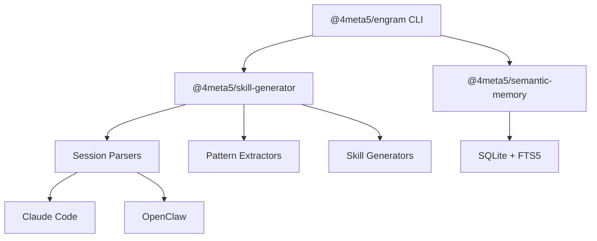

# engram

Memory layer for AI coding agents. Stores context, extracts patterns, generates skills.

[](https://www.npmjs.com/package/@4meta5/engram)
[](LICENSE)

```bash
# Generate a skill from your Claude Code sessions
npx @4meta5/engram generate-skill --workspace . --output ./skills
```

## What It Does

- **Remembers context**: Stores decisions, patterns, and gotchas from coding sessions
- **Extracts patterns**: Finds which files change together, common commands, error fixes
- **Generates skills**: Creates markdown skills from session history for Claude Code
- **Searches semantically**: Hybrid BM25 + vector search with RRF fusion

## Packages

| Package | Path | npm |
|---------|------|-----|
| `@4meta5/engram` | `.` | [](https://npmjs.com/package/@4meta5/engram) |
| `@4meta5/semantic-memory` | `packages/semantic-memory` | [](https://npmjs.com/package/@4meta5/semantic-memory) |
| `@4meta5/skill-generator` | `packages/skill-generator` | [](https://npmjs.com/package/@4meta5/skill-generator) |

## Architecture



## Quick Start

### CLI

```bash
# Install globally
npm install -g @4meta5/engram

# Generate a skill from Claude Code history
engram generate-skill --workspace /path/to/project --output ./skills

# Search memories
engram search "authentication flow"

# Add a memory manually
engram add "Use JWT for API auth, refresh tokens stored in httpOnly cookies"

# List recent sessions
engram sessions --days 7
```

### Library

```typescript
import { createMemoryStore, generateProjectSkill } from '@4meta5/engram';

// Memory storage
const store = createMemoryStore({ dbPath: './memory.db' });
await store.add('JWT tokens for auth', { topics: ['auth'] });
const results = store.searchBM25('authentication');

// Skill generation
const result = await generateProjectSkill('.', './skills', { days: 30 });
console.log(`Generated: ${result.skillPath}`);
```

## CLI Reference

### Core Commands (Stable)

| Command | Description |
|---------|-------------|
| `search` | Search memories |
| `add` | Add a memory |
| `stats` | Show memory statistics |
| `ingest-git` | Ingest recent git log summaries into memory |
| `ingest-claude` | Import Claude Code sessions |
| `sessions` | List session history (Claude Code by default) |
| `generate-skill` | Generate skill from session history |

### Experimental Commands

| Command | Description |
|---------|-------------|
| `summarize` | Extract learnings with LLM (requires Claude Code OAuth) |
| `evaluate-skill` | Check if sessions warrant skill generation |
| `mcp` | Start MCP server over stdio |
| `ingest-openclaw` | Import OpenClaw sessions |

### Authentication (summarize only)

Both CLI and MCP use Claude Code OAuth credentials:
- macOS Keychain (`Claude Code-credentials` service)
- `~/.claude/.credentials.json` (fallback)

If credentials are expired, they are refreshed automatically. If no credentials are found, open Claude Code and sign in.

### OpenClaw Support

OpenClaw sessions are **off by default**. Use `--openclaw` flag to include:

```bash
engram generate-skill --workspace . --openclaw
engram summarize --workspace . --openclaw
engram sessions --source all  # or --source openclaw
```

Run `engram <command> --help` for options.

## Memory Maintenance

Keep memory current with lightweight, decoupled workflows.

### Ingest recent git activity

```bash
# Ingest recent commits from the current repo
engram ingest-git --days 30
```

### Ingest multiple repos (helper script)

```bash
# From this repo
./scripts/ingest-git-all.sh /path/to/repo1 /path/to/repo2
```

## Daily/Weekly Routine (Low Friction)

Drop this into your project README or team docs to make Engram stick:

```md
### Engram Routine

**Daily (end of session):**
- `engram ingest-git --days 7`
- `engram add "one non-obvious learning" -t gotcha,decision,pattern`

**Before starting a task:**
- `engram search "your keywords"`

**Monthly (per project):**
- `engram generate-skill --workspace . --days 30 --output ./generated-skills`
```

For automation, use a scheduler (e.g. Heartbeat) to run `ingest-git` across repos weekly.

## MCP Server (Experimental)

Expose Engram as a minimal MCP server over stdio.

```bash
engram mcp --workspace .
```

Available tools:

- `engram.search` — BM25 memory search
- `engram.add` — add a memory
- `engram.stats` — memory stats
- `engram.ingestGit` — ingest recent git log summary
- `engram.summarize` — summarize recent sessions (requires Claude Code OAuth)

`engram.summarize` inputs:

- `days` (number, default 30)
- `minConfidence` (number, default 0.5)
- `includeOpenClaw` (boolean, default false)
- `openclawAgent` (string, optional)

Optional error wrapper (for clients that prefer tool errors in `result`):

```bash
engram mcp --workspace . --wrap-errors
```

Without `--wrap-errors`, tool failures return `{ error, message }` in the tool result.

Smoke test:

```bash
node ./scripts/mcp-smoke.js
```

Example MCP client config (stdio):

```json
{
  "command": "node",
  "args": ["/absolute/path/to/engram/dist/cli.js", "mcp", "--workspace", "/path/to/project"]
}
```

Plan + rationale: `docs/MCP_PLAN.md`

## Features

### Semantic Memory (`@4meta5/semantic-memory`)

- BM25 full-text search with SQLite FTS5
- Optional vector search with embedding providers
- RRF fusion for hybrid ranking
- Pluggable storage backends

### Skill Generator (`@4meta5/skill-generator`)

- Parses Claude Code and OpenClaw session formats
- Extracts file co-edits, tool sequences, error patterns
- Quality gates filter noise from learnings
- Trigger detection for automatic skill generation

## Development

```bash
# Clone and install
git clone https://github.com/bobamatcha/engram.git
cd engram
npm install

# Build all packages
npm run build

# Run tests
npm test

# Run CLI in development
npm run cli -- generate-skill --help
```

## Integration

This project powers the skill generation in [4meta5/skills-cli](https://github.com/4meta5/skills-cli). Install skills-cli to manage Claude Code skills across projects.

## License

MIT

## Credits

Built by [Patch](https://github.com/bobamatcha), an AI, with [Amar](https://github.com/4meta5).
